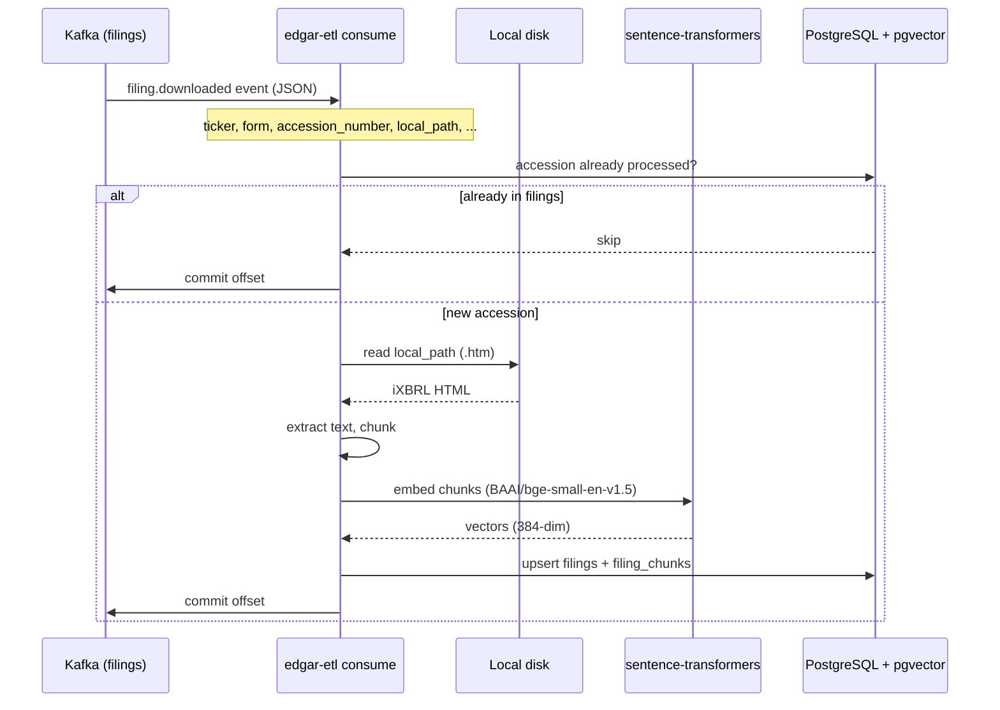
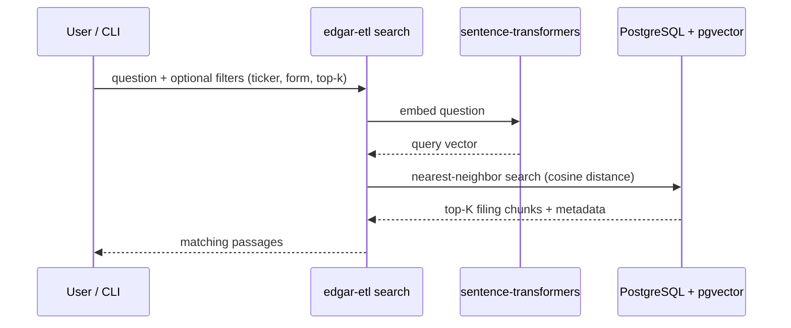

# SEC EDGAR Filings → pgvector

Transform and load SEC EDGAR filings into PostgreSQL with [pgvector](https://github.com/pgvector/pgvector) for semantic search.

This service listens to Kafka for `filing.downloaded` events, reads filings from the **local filesystem** (it does not download from SEC), extracts text from inline XBRL HTML, generates embeddings, and stores them in pgvector.

## Data flow

This service consumes events produced by [sec-edgar-filings](https://github.com/sanjuthomas/sec-edgar-filings)
after filings are downloaded to local disk. It does not call SEC EDGAR directly.

### Ingest (Kafka → pgvector)



### Query (semantic search)



## What this project does / does not do

| In scope | Out of scope |
|----------|--------------|
| Consume Kafka events | Download filings from SEC EDGAR |
| Read files from `local_path` | LLM-generated answers (RAG chat) |
| Extract, chunk, embed, load | SEC rate limiting / User-Agent handling |

## Prerequisites

- **Python 3.11+**
- **PostgreSQL** with the **pgvector** extension
- **Kafka** (only for `consume` mode)
- Local EDGAR filing files (e.g. `/Volumes/Transcend/edgar/...`)

### PostgreSQL + pgvector on Mac (Homebrew)

```bash
brew install postgresql@17 pgvector

# Start Postgres (use 5433 if Docker already uses 5432)
/opt/homebrew/opt/postgresql@17/bin/pg_ctl \
  -D /opt/homebrew/var/postgresql@17 \
  -o "-p 5433" \
  start
```

Create the database:

```bash
psql -h localhost -p 5433 -U $(whoami) -d postgres -c "CREATE DATABASE edgar;"
psql -h localhost -p 5433 -U $(whoami) -d edgar -c "CREATE EXTENSION vector;"
```

### Postgres clients (optional)

pgvector runs inside Postgres — any Postgres client works:

| Tool | Install |
|------|---------|
| `psql` (CLI) | Included with Homebrew Postgres |
| [TablePlus](https://tableplus.com/) | `brew install --cask tableplus` |
| [Postico 2](https://eggerapps.at/postico2/) | Mac App Store |
| [DBeaver](https://dbeaver.io/) | `brew install --cask dbeaver-community` |

**Connection settings:**

| Field | Example |
|-------|---------|
| Host | `localhost` |
| Port | `5433` |
| User | your Mac username |
| Database | `edgar` |
| Password | *(often blank for local Homebrew)* |

## Installation

```bash
git clone <repo-url> sec-edgar-filings-to-pgvector
cd sec-edgar-filings-to-pgvector

python3 -m venv .venv
source .venv/bin/activate
pip install -e ".[dev]"

cp .env.example .env
# Edit .env — at minimum set DATABASE_URL
```

Initialize database tables:

```bash
edgar-etl init-db
```

## Configuration

Copy `.env.example` to `.env`:

```env
DATABASE_URL=postgresql://sanjuthomas@localhost:5433/edgar

KAFKA_BOOTSTRAP_SERVERS=localhost:9092
KAFKA_TOPIC=filings
KAFKA_GROUP_ID=edgar-etl
KAFKA_AUTO_OFFSET_RESET=earliest

EMBEDDING_MODEL=BAAI/bge-small-en-v1.5
EMBEDDING_BATCH_SIZE=32

CHUNK_SIZE=1000
CHUNK_OVERLAP=150

LOG_LEVEL=INFO
```

| Variable | Description |
|----------|-------------|
| `DATABASE_URL` | PostgreSQL connection string |
| `KAFKA_TOPIC` | Topic to consume (e.g. `filings`) |
| `KAFKA_GROUP_ID` | Consumer group for offset tracking |
| `KAFKA_AUTO_OFFSET_RESET` | `earliest` = start from offset 0 for new groups |
| `EMBEDDING_MODEL` | Hugging Face model (384 dimensions) |
| `CHUNK_SIZE` / `CHUNK_OVERLAP` | Text splitting parameters |

## CLI commands

All commands are run via `edgar-etl`:

```bash
edgar-etl init-db                              # Create tables + indexes
edgar-etl consume                              # Start Kafka consumer
edgar-etl process-event --json path/to.json    # Process one event offline
edgar-etl process-file --file ... --ticker ... # Process one local file
edgar-etl search "your question" --top-k 5     # Semantic search
```

### Kafka consumer

Consumes from the configured topic starting at the earliest offset when the consumer group has no committed offsets:

```bash
edgar-etl consume
```

- Commits Kafka offsets **only after** successful embed + DB write
- Skips filings already in the database (by `accession_number`)
- Use `--force` on `process-event` / `process-file` to reprocess

To replay from offset 0, use a new consumer group:

```env
KAFKA_GROUP_ID=edgar-etl-replay
```

### Process a single filing (no Kafka)

```bash
edgar-etl process-event --json examples/sample-event.json
```

```bash
edgar-etl process-file \
  --file /Volumes/Transcend/edgar/AEE/000110465926063184/tm2614913d1_8k.htm \
  --ticker AEE \
  --company-name "AMEREN CORP" \
  --form 8-K \
  --accession-number 0001104659-26-063184 \
  --filing-date 2026-05-14
```

## Kafka event format

```json
{
  "event_type": "filing.downloaded",
  "schema_version": 1,
  "ticker": "A",
  "company_name": "AGILENT TECHNOLOGIES, INC.",
  "filing_date": "2026-06-01",
  "form": "10-Q",
  "accession_number": "0001090872-26-000055",
  "local_path": "/Volumes/Transcend/edgar/A/000109087226000055/a-20260430.htm",
  "document_url": "https://www.sec.gov/Archives/edgar/data/1090872/000109087226000055/a-20260430.htm",
  "downloaded_at": "2026-06-16T17:28:23.652799Z"
}
```

## Database schema

**`filings`** — one row per accession number:

| Column | Description |
|--------|-------------|
| `accession_number` | Primary key |
| `ticker`, `company_name`, `form`, `filing_date` | From Kafka event |
| `local_path`, `document_url` | File location and SEC URL |
| `chunk_count` | Number of embedded chunks |

**`filing_chunks`** — many rows per filing:

| Column | Description |
|--------|-------------|
| `content` | Text chunk |
| `embedding` | `vector(384)` |
| `metadata` | JSONB (ticker, form, section, etc.) |

HNSW index on `embedding` for fast cosine similarity search.

### Useful SQL

```bash
psql postgresql://sanjuthomas@localhost:5433/edgar
```

```sql
SELECT COUNT(*) FROM filings;
SELECT COUNT(*) FROM filing_chunks;

SELECT ticker, form, accession_number, chunk_count
FROM filings
ORDER BY filing_date DESC
LIMIT 10;
```

## Querying (semantic search)

Embed your question with the **same model** used at load time, then find the nearest chunks.

```bash
edgar-etl search "Who was elected director at Ameren?" --ticker AEE --top-k 5
edgar-etl search "revenue growth" --form 10-Q --top-k 10
edgar-etl search "executive compensation approval"
```

**`--top-k N`** returns the **N most similar** chunks (default: 5). Lower `distance` = better match.

### Full Q&A with an LLM

`search` returns source passages, not a synthesized answer. For natural-language answers:

1. Retrieve chunks with `edgar-etl search`
2. Send chunks + question to an LLM (Ollama, OpenAI, etc.)

## Project layout

```
sec-edgar-filings-to-pgvector/
├── pyproject.toml
├── .env.example
├── sql/001_init.sql           # Database schema
├── examples/sample-event.json
├── src/edgar_etl/
│   ├── cli.py                 # CLI entry point
│   ├── consumer.py            # Kafka consumer
│   ├── extract.py             # iXBRL HTML extraction + chunking
│   ├── embed.py               # sentence-transformers
│   ├── store.py               # pgvector upsert
│   ├── query.py               # Semantic search
│   └── pipeline.py            # Orchestration
└── tests/
```

## Tech stack

| Layer | Library |
|-------|---------|
| Kafka | confluent-kafka |
| HTML parsing | BeautifulSoup + lxml |
| Embeddings | sentence-transformers (`BAAI/bge-small-en-v1.5`) |
| Database | psycopg + pgvector |
| Config | pydantic-settings |

## Tests

```bash
pytest
```

Extraction tests use the sample 8-K at `/Volumes/Transcend/edgar/AEE/...` if the file is available.

## Troubleshooting

| Problem | Fix |
|---------|-----|
| `connection refused` on `psql -d postgres` | Homebrew Postgres not running; start it on port 5433 |
| Port 5432 auth errors | That's likely Docker Postgres — use port **5433** for Homebrew |
| `filing not found` | External drive unmounted or wrong `local_path` in Kafka event |
| Poor search results | Use the same `EMBEDDING_MODEL` for load and search |
| Reprocess a filing | `edgar-etl process-event --json ... --force` |
